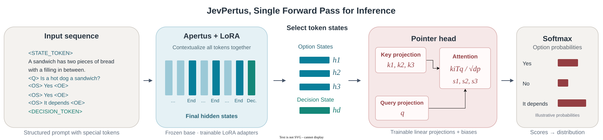

# JevPertus


[](#license)
[](https://github.com/jaredpalmer/kev/blob/main/LICENSE)

A simple, lightweight implementation of the Jev model on top of the Apertus LLM.
JevPertus combines an Apertus text backbone, LoRA adapters, and a small pointer head to assign probabilities to a question's answer options.

It supports multiple-choice questions, ordered rating scales, and true/false statements. Predictions come from scoring the supplied options in a single backbone pass.

## How does Jev work?

The implementation is based on the Blogpost from [Archerhume](https://archerhume.com/posts/jevs-architecture-unmasked) and the [Kev repository](...) applied to the [Apertus LLM](https://huggingface.co/swiss-ai/Apertus-v1.5-8B).

The simple idea is to encode a "State", a "Question", the "Options" and a final "Decision" into a single sequence.
This looks somthing like this:

```text
<STATE_TOKEN> A Sandwich is defined as a food item consisting of two pieces of bread with a filling in between.
<QUESTION_TOKEN> Is a hot dog a sandwich?
<OPTION_START_TOKEN> Yes: a hot dog is a sandwich.<OPTION_END_TOKEN>
<OPTION_START_TOKEN> No: a hot dog is not a sandwich.<OPTION_END_TOKEN>
<OPTION_START_TOKEN> It depends on the culture.<OPTION_END_TOKEN>
<DECISION_TOKEN>
```

We can then feed this sequence into an LLM and extract the final hidden states for each of the `<OPTION_END_TOKEN>` tokens and the `<DECISION_TOKEN>` token.
This gives us a representation of each option and the decision point, which we can then use to score the options and make a final decision.



This is done by passing the final hidden states through a small pointer head, which outputs a probability distribution over the options. For example, if we say $\vec{h}_1, \vec{h}_2, \vec{h}_3$ are the final hidden states for the three option tokens (`<OPTION_END_TOKEN>`), and $\vec{h}_d$ is the final hidden state for the decision token (`<DECISION_TOKEN>`), we can compute the scores for each option using the pointer head as follows:

First, project the decision state into a query vector shared by all options:

$$
\vec{q} = W_q\vec{h}_d + \vec{b}_q
$$

For option 1 ("Yes"), project its hidden state into a key vector and compute its score:

$$
\vec{k}_1 = W_k\vec{h}_1 + \vec{b}_k, \qquad s_1 = \frac{\vec{k}_1^\top\vec{q}}{\sqrt{d_p}}
$$

For option 2 ("No"), use the same key projection and query:

$$
\vec{k}_2 = W_k\vec{h}_2 + \vec{b}_k, \qquad s_2 = \frac{\vec{k}_2^\top\vec{q}}{\sqrt{d_p}}
$$

For option 3 ("It depends on the culture"), repeat the calculation:

$$
\vec{k}_3 = W_k\vec{h}_3 + \vec{b}_k, \qquad s_3 = \frac{\vec{k}_3^\top\vec{q}}{\sqrt{d_p}}
$$

Here, $W_k, \vec{b}_k$ and $W_q, \vec{b}_q$ are the learned key and query projection weights and biases, and $d_p$ is the pointer dimension. The code computes all three scores together in a single matrix-vector multiplication. This is basically a form of attention where the decision state attends to the option states.
We can then apply a softmax to the scores to get a probability distribution over the options.

## Setup

Use Python 3.11 or newer.
From the repository root:

```bash
python -m venv .venv
source .venv/bin/activate
python -m pip install -r requirements.txt
```

For GPU use, install a PyTorch build compatible with your CUDA environment.

The default backbone is `swiss-ai/Apertus-v1.5-8B`. The loader downloads model files from Hugging Face when they are not cached; it also accepts a local checkpoint directory. Configure Hugging Face credentials if your chosen checkpoint requires authentication.

The full backbone must fit on the selected device alongside activations and training state.

## Data format

The training script reads `data/train.jsonl` and evaluates on `data/test.jsonl`. Each line is a JSON object containing a shared `state` and a mapping of question IDs to labeled questions:

```json
{
  "state": "You live in Zurich.",
  "questions": {
    "q1": {
      "type": "choice",
      "instructions": "Which country do you live in?",
      "criteria": {
        "A": "Switzerland",
        "B": "France"
      },
      "label": "A"
    },
    "q2": {
      "type": "noul",
      "instructions": "You live in Switzerland.",
      "label": true
    },
    "q3": {
      "type": "score",
      "instructions": "How certain are you?",
      "criteria": [
        "Uncertain",
        "Certain"
      ],
      "label": 1
    }
  }
}
```

| Type     | `criteria`                                                | Label in JSONL                                         |
| -------- | --------------------------------------------------------- | ------------------------------------------------------ |
| `choice` | Mapping of answer keys to descriptions, in option order   | Answer key such as `"A"`, or a zero-based option index |
| `score`  | Ordered list of rating descriptions                       | Zero-based option index                                |
| `noul`   | Optional mapping with `"false"` and `"true"` descriptions | Boolean, or `0` for false and `1` for true             |

Every training and evaluation question needs a label. The loader converts choice keys and boolean labels into zero-based indices. For inference, supply an individual question with its own `state` and omit the label.

## Training

An example train script can be found in `train_jevpertus.py`.
To configure training, set the following environment variables:

| Setting         | Default                    |
| --------------- | -------------------------- |
| `BASE_MODEL`    | `swiss-ai/Apertus-v1.5-8B` |
| `DATA_DIR`      | `data`                     |
| `DEVICE`        | `cuda:0`                   |
| `EPOCHS`        | `2`                        |
| `BATCH_SIZE`    | `1`                        |
| `LORA_RANK`     | `16`                       |
| `LEARNING_RATE` | `5e-5`                     |
| `OUTPUT_DIR`    | `runs/jevpertus-v1.5-8B`   |

Training writes per-step loss and per-epoch evaluation metrics to `loss_history.jsonl`, and saves a checkpoint after each epoch:

```text
runs/jevpertus/
├── loss_history.jsonl
├── epoch_1/
│   ├── adapter_config.json
│   ├── jev_config.json
│   └── jev.pt
└── epoch_2/
    ├── adapter_config.json
    ├── jev_config.json
    └── jev.pt
```

Checkpoints contain the LoRA adapter weights, pointer-head weights, and configuration. Base-model weights and optimizer state are not saved. Loading a checkpoint requires access to its base model. Choose a new `OUTPUT_DIR` for each run to preserve previous metrics and checkpoints.

## Inference

To see how JevPertus performs on a few example questions, run `inference_jevpertus.py`. The script loads a checkpoint and prints predictions for three sample questions.

The examples cover all three question types. Choice and score questions print a probability for each option; `noul` questions print the probability of true.

## Benchmark results

Accuracy (%) on the full test splits; Global-MMLU averages English, German, French,
and Italian accuracies, while other rows weight each question equally. Both JevPertus
runs use checkpoints after two training epochs and zero-shot pointer-head scoring:
`runs/jevpertus-v1.5-8B/epoch_2` for `swiss-ai/Apertus-v1.5-8B` and
`runs/jevpertus-8B-Instruct-2509/epoch_2` for `swiss-ai/Apertus-8B-Instruct-2509` (V1).
These are scores for the trained Jev model, not the unmodified Apertus backbone.

| Benchmark                      | Questions | Jev + Apertus v1.5-8B | Jev + Apertus 8B-Instruct-2509 | Apertus v1.5-8B Instruct (original) | Apertus 8B-Instruct-2509 (paper) |
| ------------------------------ | --------: | --------------------: | -----------------------------: | ----------------------------------: | -------------------------------: |
| MMLU                           |    14,042 |                 50.51 |                          54.20 |                         Coming Soon |                             60.9 |
| MMLU-Pro                       |    12,032 |                 27.90 |                          25.85 |                         Coming Soon |                                - |
| ARC-Challenge                  |     1,172 |                 73.63 |                          74.32 |                         Coming Soon |                             77.6 |
| Global-MMLU (language average) |    56,168 |                 47.14 |                          51.01 |                         Coming Soon |                             55.7 |

Paper scores are for **Apertus-8B-Instruct (v1)**, from
[Table 17](https://arxiv.org/html/2509.14233v2#S5.T17) (MMLU and Global-MMLU)
and [Table 21](https://arxiv.org/html/2509.14233v2#S5.T21) (ARC Challenge Chat).

### Running the benchmarks

```bash
python evaluate_benchmarks.py \
  --checkpoint runs/jevpertus-v1.5-8B/epoch_2 \
  --benchmarks mmlu mmlu-pro arc-challenge global-mmlu \
  --languages en de fr it \
  --device cuda:0 --batch-size 1
```

Results default to the checkpoint's `evals/` subfolder, here
`runs/jevpertus-v1.5-8B/epoch_2/evals/`

## Project layout

| File                          | Purpose                                                        |
| ----------------------------- | -------------------------------------------------------------- |
| `dataloader.py`               | JSONL loading, question encoding, padding, and batching        |
| `modeling/apertus/apertus.py` | Apertus text architecture                                      |
| `modeling/apertus/loading.py` | Loading compatible original Apertus and V1.5 text checkpoints  |
| `modeling/pointerhead.py`     | Option-scoring head                                            |
| `modeling/jev.py`             | Backbone/head composition, LoRA setup, and checkpoint handling |
| `train_jevpertus.py`          | Training and evaluation entry point                            |
| `inference_jevpertus.py`      | Checkpoint loading and example predictions                     |

## Acknowledgments

JevPertus builds on the Apertus backbone. The banner is inspired by the Apertus wordmark, with custom JevPertus lettering.

## Authors

- [Jan-Lucas Uslu](https://github.com/Jaluus) - JevPertus.
- [Jared Palmer and the Kev contributors](https://github.com/jaredpalmer/kev) - source of the data included in this repository.

## License

- **Code:** licensed under the [MIT License](https://opensource.org/license/mit).
- **Data:** the datasets in `data/` come from [Kev](https://github.com/jaredpalmer/kev) and are licensed under [Apache License 2.0](https://github.com/jaredpalmer/kev/blob/main/LICENSE). Upstream copyright: 2026 Jared Palmer.
